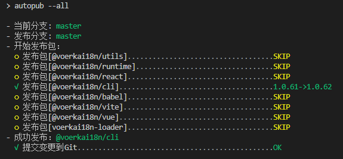

# 概述

`AutoPub`是一个让你爽到起飞的`pnpm/monorepo`工程一健自动发包工具。

本工具是在开发[VoerkaI18n](https://zhangfisher.github.io/voerka-i18n/)解决方案（非常不错的多语言解决方案）时的副产品，`voerkai18n`是一个标准的`monorepo`工程，包含了`@voerkai18n/cli`、`@voerkai18n/runtime`、`@voerkai18n/utils`、`@voerkai18n/vue`、`@voerkai18n/vite`、`@voerkai18n/babel`、`@voerkai18n/react`、`@voerkai18n/formatters`等多个包，发布包时容易引起混乱问题，主要问题：

- 经常忘记哪个包最近什么时间修改，哪个包应该发布，没办法，记性不好。
- 由于包之间存在依赖关系，需要按一定的顺序进行发布 
- 版本号要能自动递增

`AutoPub`可以自动一键发布自最近一次发包以来有修改过的包，整个发包过程可以实现全自动。
 
有了`AutoPub`，发布时，只需要执行`pnpm autopub`，妈妈再也不担心我的发包了。

**`voerkai18n`使用`AutoPub`进行发包的实例：**




# 快速入门

!> 本工具在`pnpm/monorepo`环境下测试通过，不适用于`lerna/yarn`等`monorepo`工程。

## 第一步：安装

一般建议安装在全局，也可以安装在当前工作区。

```shell
> pnpm add -g autopub
> npm install -g autopub
> yarn global add autopub
```

## 第二步：注入发包脚本

接下来可以调用`autopub init`来为当前工作区注入必要的脚本。
```shell
> autopub init
```

- **`autopub init`命令会在工作区的`package.json`注入脚本**

```javascript
// package.json
{
    "scripts":{
        "publish:test":"pnpm autopub --test",
        "publish:auto":"pnpm autopub --all", 
        "publish:all":"pnpm autopub",  
        "publish:[包名称]":"pnpm autopub --package [包名称]",    
        "publish:[包名称]":"pnpm autopub --package [包名称]",    
        ......
    }
}

``` 
!>  `publish:mock`、`publish:auto`、`publish:all`仅是默认注入的发包命令，您也可以自己根据`autopub`命令行参数自己编写发包命令，比如编写`publish:beta`之类发布带有`distTag`的包，参见后面命令行参数介绍。
     
## 第三步：自动发布

当配置好以上发包脚本后，在需要发布时就可以直接调用相应的脚本命令来发包了。

- **一键自动化发包**

一键发布自最近一次发包以来有修改过的包,不需要人工介入,整个过程全自动完成，这是平时享受发包快感的主要来源。

在开发`VoerkaI18n`时，当修改了源码，提交了N次后，需要发包时，就来一发，那爽劲不可描述。

```javascript
> pnpm publish:auto
```

- **交互自动发包**

`pnpm publish:auto`是全自动发包，而`pnpm publish:all`命令则会询问用户要发哪个包，以及发布的标签等。

```javascript
> pnpm publish:all
``` 
- **发布指定包**

当想发布指定包时，只需要执行`publish:<包名称>`即可，如下：

```shell
> pnpm publish:<包名称>
```

# 指南

## 工作机制

`autpub`主要用于基于`pnpm`的`monorepo`工程的自动发布，`autpub`的基本原理非常简单，就是**自动找出当前工程下的自上次发布以后有更新的包（有过Git提交）进行自动构建并发布。**

`autpub`工作流程如下：

- **第一步：找出当前工程需要发布的包** 

扫描整个工程（主要是`packages`)下的所有工程（包括其子目录的）信息，过滤掉`<package.json>.private=true`的包。

- **第二步：检查包自上次发布以来是否有更新**

1. 首先需要读取工程最近发布一次发布的时间   
    - 读取`<package.json>.lastPublish`字段，每次成功发布时均会在`<package.json>.lastPublish`记录发布时间。
    - 如果`lastPublish`为空，则说明没有进行过发布，此时应则执行`npm info <包名>`，从`npm`中读取该包的发布时间。

2.  接下来，获取包自上次发布以来的的Git提交次数
    -  `autopub`每次成功发布后，由于会通过`npm version`命令更新版本号，从而导致`package.json`变更。因此，`autopub`会在每次成功发布后，再自动进行一次`git commit -a -m "autopub release: <发布的包信息>"`。
    这样，**在当前`git`仓库的`commit`记录中就会存一条`message="autopub release: <发布的包信息>"`的`commit`记录，这是重点！！！**
    - 基于此，通过执行`git shortlog HEAD --after=<最后发布时间> -s --grep "autopub release" --invert-grep -- <包路径>`命令就可以得到包自上次发布以来的的Git提交次数。

3. 根据以上获取的提交次数就可以知道自上次发布以来包是否有过更新。

- **第三步：依次发布包**

至此机制，`autopub`就可以筛选出当前`monorepo`工程下自上次发布以来有更新的包清单。
接下来就可以依次对有更新的包进行发布了。

**`autopub`发布包的流程如下：**

1. **自增版本号**

发包前第一步执行`npm version  <major | minor | patch | premajor | preminor | prepatch | prerelease>`自动增加版本号。版本号的增长方式默认是`patch`

2. **构建包**

一般发布前需要进行`build`。事实上`autopub`不会进行构建，只是调用当前包的`build`脚本命令。
因此，您需要在当前`<package.json>.scripts`下定义一个名称为`build`的构建命令即可。 

3. **开始发布**

然后就开始执行`pnpm publish`发布命令。

4. **更新发布时间**

当发布成功后，就在当前包的`<package.json>.lastPublish`记录下当前时间，这个时间就是下次进行发布时需要使用的关键。

5. **提交发布信息**

由于上述发布过程中执行`npm version`命令和修改`<package.json>.lastPublish`会导致`package.json`文件被修改，因此我们需要将此修改也提交到`Git`仓库。

**重点来了！！** 此提交不是简单地执行`git commit`命令，而是执行约定的`git commit -a -m "autopub release: <发布的包信息>"`命令，形式如`autopub release: @voerkai18n/formatters(v1.0.26)`。
当下次发布时，就是通过查找最近发布时间以下的提交历史信息中的`autopub release`信息来定位和检索提交次数。 

所以，每次完整的发布均会在Git提交历史中提交一条`git commit -a -m "autopub release: <发布的包信息>"`，通过`git log`命令就可以完整地列出发布历史。

## 全自动发包

当启用`autpub --all`时进行全程自动化发包，`autpub`会比对最近发布时间和最近Git提交时间，然后自动发布自上一次发布以来进行过提交的包。
整个发布过程是全自动的，不需要人工介入。

- 绝大多数情况下，您只需要在进行了Git提交后，运行一下`autopub --all`即可，不需要去操心要发哪个包。
- 自动发包时会自动增加版本号，默认会自动增加版本`patch`值，也可以指定版本自增方式,如`autopub --all -i minor`。

## 交互式发包

如果没有启用`--all`时,会询问用户:

- 选择要发布的包
- 版本自动增长方式
- 发布标签

## 发包顺序

由于工作区包之间存在依赖关系，某此包的发布可能会依赖于其他包，因此`autopub`会根据依赖关系进行排序发布和关联发布。比如`@voerkai18n/cli`依赖于`@voerkai18n/utils`，当`@voerkai18n/utils`有更新需要发布时，`@voerkai18n/cli`也会自动发布。

## 版本自动增长方式

默认情况下，发包时均会升级`patch`版本号，可以通过`-i`参数来修改递增版本号。

```shell
> pnpm publish:auto -i <major | minor | patch | premajor | preminor | prepatch | prerelease>
> pnpm autopub -i <major | minor | patch | premajor | preminor | prepatch | prerelease>
```

如果您要修改默认的版本自动增长方式,可以修改工作区`package.json`，如下：

```javascript
{
    "scripts":{
         "publish:auto":"pnpm autopub --all -i minor",  // 每次发包均递增minor
    }
}
```
也可以在工作区的`package.json/autopub`配置文件中指定默认的版本自增方式
```javascript
{
    autopub:{
        versionIncStep: "patch"                
    }
}
```

## 发布前构建

`autopub`发布前会自动调用当前包`<package.json>.scripts`中的`build`脚本进行构建。 

如果发布前不需要执行构建，则可以添加`--no-build`参数，如`autopub --no-build`

## 模拟发布

启用`--test`参数可以进行模拟发布，该参数会导致走完整个发包流程，但是没有实际发布到`NPM`。
该参数主要用于测试。

`--test`参数本质上是在执行`pnpm publish`时添加`--dry-run`参数。

## 排除要发布的包

在`packages`文件夹下的包，有些是测试应用等，并不需要进行发包，此时就需要配置需要排除哪些要发布的包，方法非常简单，只需要设置`package.json`中的`privite=true`即可.
```javascript
{
    "private":true
}
```
## 发布报告

当执行完自动发包会生成一份当前工作区的所有包的简单发布信息，目前支持两种格式：

- **MarkDown**

样式可以参见[这里](https://zhangfisher.github.io/voerka-i18n/guide/intro/versions)

- **JSON**

```javascript
{
    "包名称":{
        version:"<最新版本号>",
        lastPublish:"<最近发布时间>",
        description:"<包描述，即该package.json中描述>"
    }
}
```

发布报告默认生成在当前工作区下，文件名是`versions.md`，如果要更改文件名称或生位置，需要修改当前工作区`package.json`中配置。

```javascript
{
    "autopub":{
        "report": "versions.md",                 // <当前工作区>/versions.md
        "report": "versions.json",               // <当前工作区>/versions.josn
        "report": "docs/versions.md",            // <当前工作区>/docs/versions.md
        "report": "docs/versions.json",          //<当前工作区>/docs/versions.json
    }
}
```

- 发布报告可以用来自动更新到项目文档中，效果见[这里](https://zhangfisher.github.io/voerka-i18n/guide/intro/versions)
- 当前发布报告还比较简单，后续考虑增加`CHANGELOGS`。

## 单独包发布

大部份情况下，只需要执行`autopub --all`进行自动发布即可，或者也可以执行`autopub`，然后在交互询问时选择要发布的包。
也可以通过`--package`参数指定来单独发布某个包。
```shell
> pnpm autopub --package <包名>
```
## 发布标签

发布时可以指定`autopub --dist-tag <标签>`用来指定发布标签，例如`autopub --dist-tag beta`。

## 发布分支

默认情况下，发布分支采用当前Git分支，也可以指定要发布哪一个分支，然后在执行`autopub`时会切换到该分支再进行发布。
```shell
> pnpm autopub --release-branch master              #切换到master分支
> pnpm autopub -b master
```


## 默认配置

`autopub`的一些默认参数可以在当前工作区`package.json`中配置，这样就不用每次均在命令行输入了。

```javascript
{
    "autopub":{
        "report": "versions.md",           // 发包报告,支持md和json两种格式
        "excludes":["utils","apps"],       // 可选的，指定排除某些包，使用private=true也可以
        "versionIncStep": "patch",         // 默认版本增长方式
        "releaseBranch": "",               // 发布分支
        "distTag":""                       // 发布标签
    }
}
```
## 同步包发布信息

执行`autopub sync`命令会读取包在`NPM`上已发布的包信息(主要是最近发布的时间)，然后更新到本地`package.json`的`lastPublish`字段中。
`autopub`需要知道最近一次发布是什么时候，才能以此时间为基准来读取自`lastPublish`时间以来是否有提交，从而进行自动发包。

**什么时候使用该命令？**

- 当在使用`autopub`以前就发布过包的,则应该同步发布信息
- 如果`package.json`没有及时同步或冲突导致`package.json`的`lastPublish`字段值丢失或者失效时，也应该执行此命令来同步。

每一次使用`autopub`发布包时，均会更新对应包的`package.json`的`lastPublish`字段值。这样一般情况下是不需要调用`autopub sync`的。
如果您不是使用`autopub`发布包，则此时就缺少或不正确的`lastPublish`字段值，这样`autopub`就不能正确进行一健自动发包。
此时，就需要执行`autopub sync`命令来修复`package.json`中`lastPublish`字段值到正确的值。
## 列出包

`autopub list`列出当前工作区的所有包，并显示当前包`最近发布时间`和`自上次发布以来的GIT提交数`。


# 常见问题

- **Q：调用`autopub`时为什么要使用`pnpm autopub`的方式?**

因为在`pnpm/monorepo`工程中，包与包之间可能存在依赖关系，并且其依赖采用的是类似`workspace:^1.0.2`的形式，使用`pnpm autopub`形式时，`pnpm`才可以帮助进行依赖的转换,否则不能正确地处理包与包之间的依赖。

- **Q: `pnpm -r publish`也可以自动发布所有包，还有必要使用`autopub`吗?**

当运行此命令`pnpm -r publish`时,`pnpm`将把所有版本尚未发布到注册表的包发布。但是这个命令是比较鸡肋的，并不能自动发包。
具体效果谁用谁知道，否则就没有必要再开发`autopub`了。